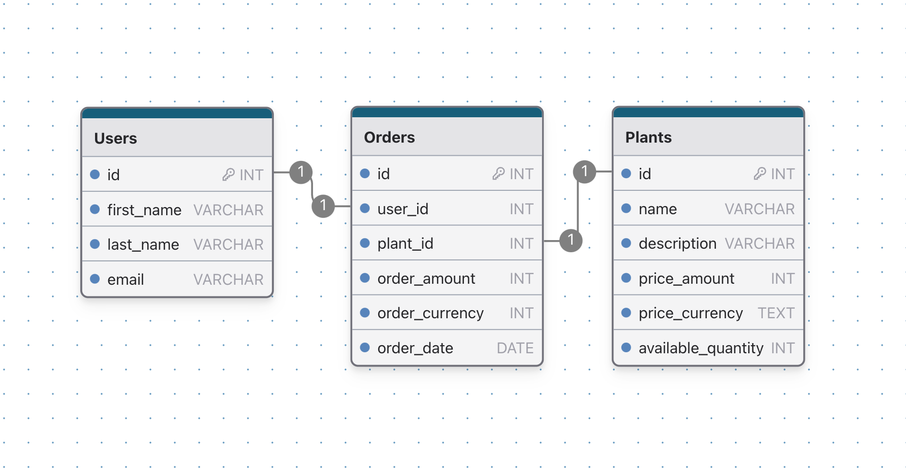

	<h1>Plantify</h1>

This project is a small prototype to show my skills with DDD.

## Database Architecture

The following image depicts the architecture of the database:

## Project Structure

This project adheres to the principles of DDD and is accordingly sectioned into the following Projects:

- **Domain**: houses all the model definitions and the core business rules.

- **Infrastructure**: establishes connectivity with all services and databases.

- **Application**: This layer provides all the methods necessary to interact with the infrastructure.

- **API**: The API facilitates interaction between the client and server.